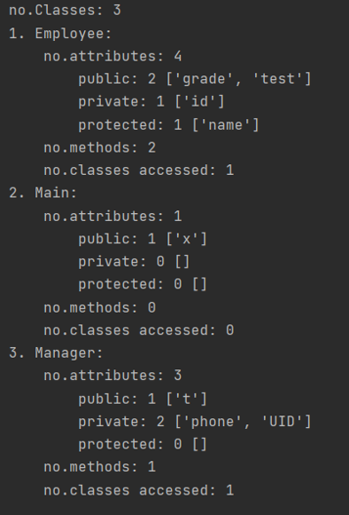

# Code Analyzer
Compiler Spring 2021 Project

This repository contains codes for the final (bonus) project of the Compiler course Spring 2021 at IUST.

## Overview

This program is an analyzer for Java projcets. It uses [ANTLR] to parse the codes.
It analyzes the following characteristics:
- number of classes
- number of attributes
- type of each attribute (public, private, protected)
- number of methods
- number of class accesses in each class in the project.

## Sample Result
The test project can be found in the `test` directory in the repository.

  

[ANTLR]: <https://www.antlr.org/>
